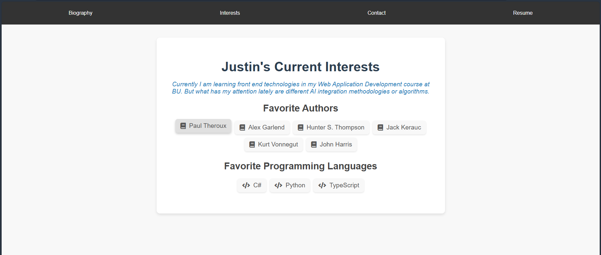

# Justin McClain's Portfolio
My personal portfolio site, developed using React with TSX and deployed on Vercel.  

## View source code on github
`https://github.com/justinprogdev/justin-mcclain-portfolio`

## View the site deployment on Vercel  
`https://justin-mcclain-portfolio-2c24.vercel.app/`

## Runbook  
1. Clone the repo:   
`git clone https://github.com/justinprogdev/justin-mcclain-portfolio
cd justin-mcclain-portfolio`
2. Install npm.  
`npm install`  
3. Start server.  
`npm start`    
4. Browse to http://localhost:3000

## Deployment  
- Vercel  
`npm install -g vercel`  
- Run vercel  
`vercel`
- Deploy  
`vercel --prod`  

## Site Overview  
1. The default route to the site (/) lands on biography.  
  
2. Interests - Interests have hover over effects for each author or programming language (each interest)
  
3. Contact - Contact form defaults to a form, but when filled out (and validated) the form will hide and render my contact info.  There are also hover effects on the button.  
  

4. Resume Page - A page with a resume reader, subtly styled. Also has download feature.  

-- Navigation  
`npm install react-router-dom`